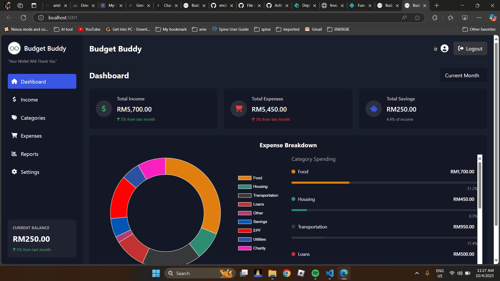

# Budget Buddy

"Your Wallet Will Thank You"

## Overview

Budget Buddy is a personal finance management application that helps users track their income, expenses, and savings. With an intuitive dashboard and detailed reports, Budget Buddy makes it easy to visualize your financial health and make informed decisions.

## Features

- **Dashboard**: Get a quick overview of your financial status with total income, expenses, and savings
- **Income Tracking**: Record and categorize different sources of income
- **Expense Management**: Track expenses by categories
- **Category Management**: Create and manage custom expense categories
- **Reports**: View detailed financial reports with charts and graphs
- **Data Export**: Export your financial data as CSV or JSON
- **User Authentication**: Secure login and registration system

## Technologies Used

- Node.js
- Express.js
- MongoDB
- EJS Templates
- Chart.js
- CSS3
- JavaScript

## Installation

1. Clone the repository
2. Install dependencies: `npm install`
3. Set up environment variables (see `.env.example`)
4. Start the server: `npm start`
5. Visit `http://localhost:5002` in your browser

## Deployment

### Vercel Deployment

Budget Buddy is configured for deployment on Vercel. For detailed deployment instructions, see [VERCEL_DEPLOYMENT.md](VERCEL_DEPLOYMENT.md).

1. Push your code to GitHub
2. Connect your GitHub repository to Vercel
3. Configure environment variables in Vercel
4. Deploy your application

## Screenshots

## Credits

Developed by Hafizan
